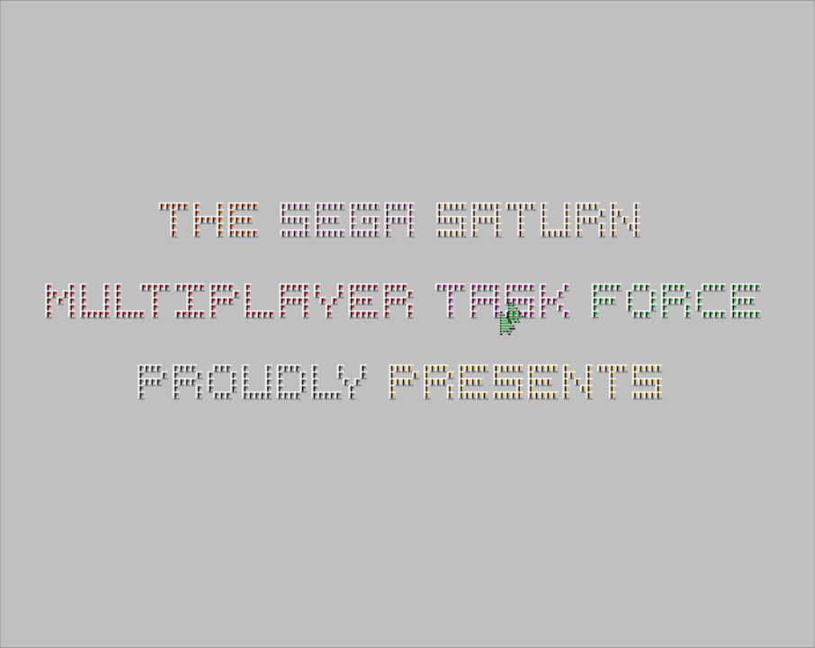
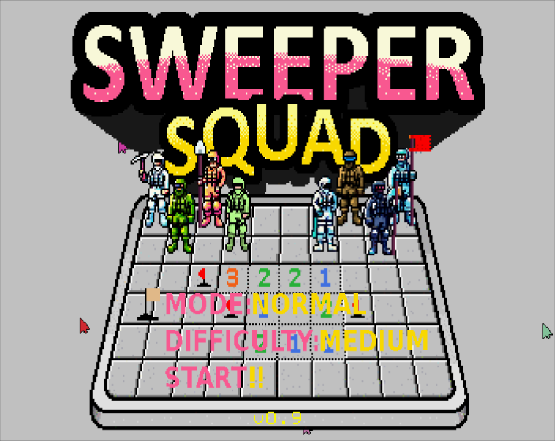
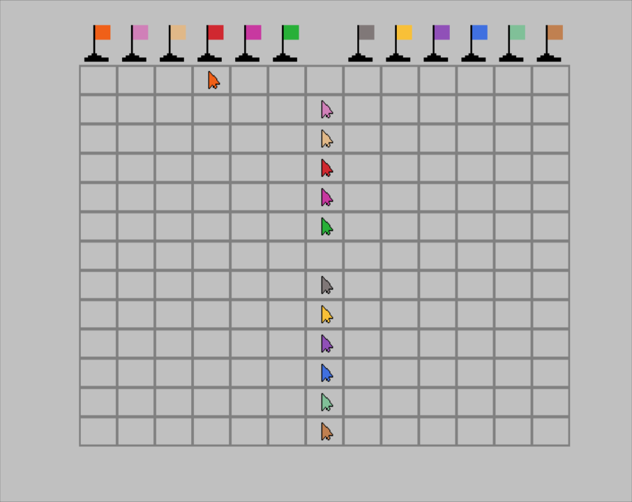
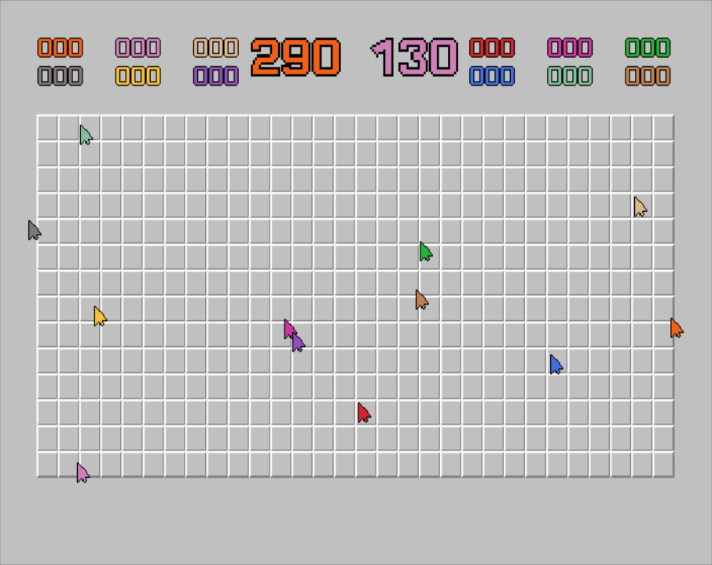
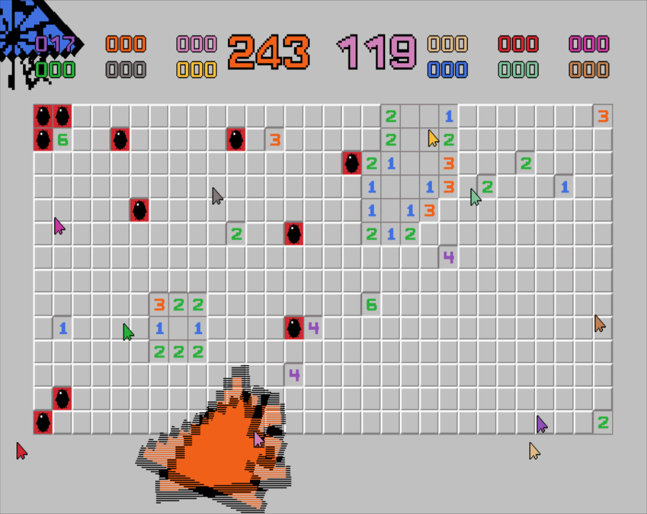
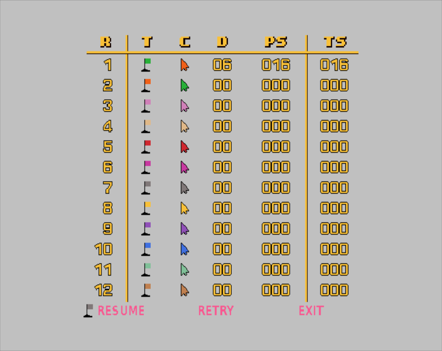

# Sweeper Squad
Sweeper Squad is a 12-player Minesweeper clone for the Sega Saturn. Requires two [6 Player Adaptors](https://segaretro.org/Saturn_6_Player_Adaptor) for full twelve player support. Requires a modded Saturn or another method to get code running on actual hardware. Build the code with Jo Engine or grab an ISO from [releases](https://github.com/slinga-homebrew/Sweeper-Squad/releases).

Sweeper Squad was my entry to the [Sega Saturn 29th Anniversary Game Competition](https://segaxtreme.net/threads/sega-saturn-29th-anniversary-game-competition.25411/).

## Screenshots

## How to Play

## Game Controls

## Player One Special Commands

## Burning
On Linux I was able to burn the ISO/CUE + WAV with: cdrdao write --force game.cue.   

## Building
Requires Jo Engine to build. Checkout source code folder to your Jo Engine "Projects" directory and run "./compile.sh".   
 
## Credits
* EmeraldNova for game idea
* Thank you to Reyeme for the title screen graphics, advice
* Thank you to Danthrax for voting on the name
* Cerbero for bug reports
* Lots of advice and feedback from the #segaxtreme Discord (Fafling, Ndiddy, Ponut, and more)
* Thank you to [Emerald Nova](www.emeraldnova.com) for organizing the Saturn Dev contest
* [SegaXtreme](http://www.segaxtreme.net/) - The best Sega Saturn development forum on the web. Thank you for all the advice from all the great posters on the forum.
* [Jo Engine](https://github.com/johannes-fetz/joengine) - Sega Saturn dev environment
